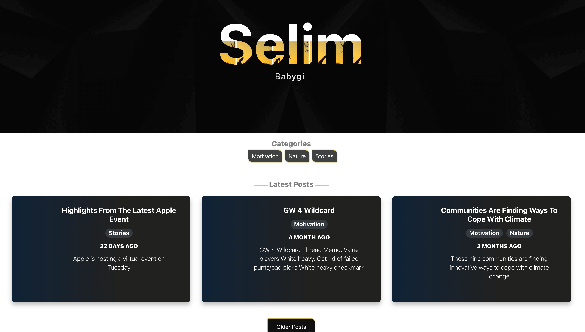

# Blog Web App

## Table of contents
* [General Info](#general-info)
* [Description](#description)
* [App Screenshot](#app-screenshot)
* [Technologies](#technologies)

### General Info 
This is a blog application was developed using a **React JS**  for its frontend. This project is part of a full-stack app which uses a Headless CMS and Postgres.

### Description 
+ This project is pubished on netlify.
+ VERSION: v 1.0

### App Screenshot

### Technologies 
Project is created using:

* Apollo Client - for GraphQL calls and In-Memory Caching
* Bootstrap
* Moments - for dateTime formatting
* MarkDownIt - for markdown conversion

### Future Additions
* Implement push notifications

### Who do I talk to? 
* Repo owner : `isaac.afrifa3@yahoo.com`

